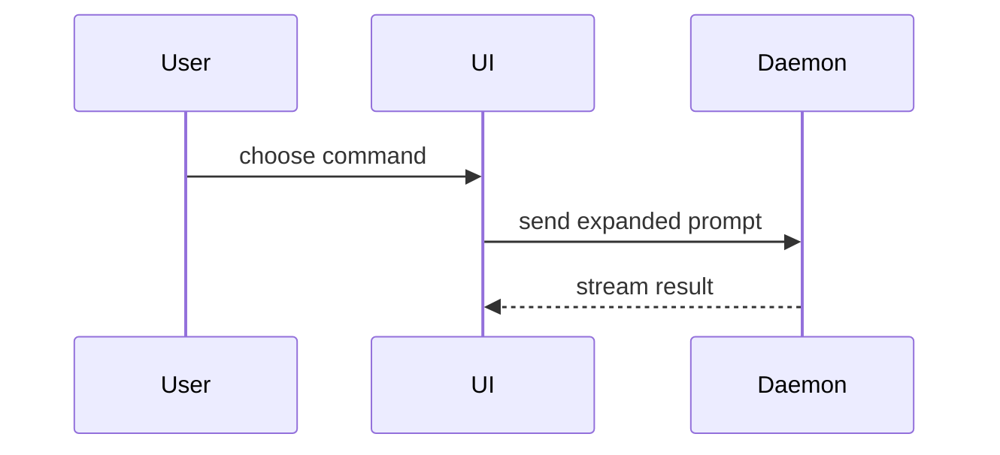

# 寫 PR Body

## 流程

1. **界定範圍**：先取得使用者提供的 commit hash（或 commit range）界定這份 PR 涵蓋的變更。使用者沒給就請他提供並停止——拿到 commit hash 才繼續，不自己猜範圍。
2. **檢視變更**：用唯讀 git（`git show`、`git diff`）看該範圍的實際變更，作為填寫各 section 的依據。
3. **產出 md**：依下方模板與各 section 指引，把 PR body 寫成一份 Markdown 檔，檔名 `pr-<scope>.md`（`<scope>` 用範圍最新 commit 的 short hash），放 repo 根目錄。

**完成判準**：有 commit hash 界定的範圍、Summary／Evidence／Merge Danger 三段都依實際變更填好，並寫出 `pr-<scope>.md`。

## 模板

```markdown
## Summary

<diagram, diff-sketch, or tree>

## Evidence

- **Before:** <output/failing test run>
  **After:** <output/passing test run>

## Merge Danger

**Door:** <one-way or two-way>

<optional: description>

**Blast Radius:** <one-word description>

<optional: potential ramifications of merge>
```

## Sections

文字精簡、直接進重點。沿用 `GLOSSARY.md` 裡使用者的領域語言。

### Summary

挑能把重點講清楚的最小視圖。

- 用 pseudocode 表達邏輯或演算法：

```text
on(save)
  if content is unchanged
    return cached result
  write new content
  return fresh result
```

- 用 call tree 表達執行期的控制流：

```text
submitForm
  createSession
    persistPrompt
    launchAgent
  navigateToSession
```

- 用 component tree 表達 UI 結構，含關鍵的 state 與模組邊界：

```text
<SessionPage> (apps/example/src/routes/session.tsx)
  useSessionEvents()
  <SessionToolbar>
    <RunSkillButton> (packages/ui)
```

- 用淺層 file tree 表達檔案職責或大範圍重構：

```text
src/
├── commands/       # parses user actions
├── sessions/       # owns session state
└── transport/      # sends API requests
```

- 用 Mermaid 表達元件互動、控制流或資料流：



- 當重點是「改了什麼」而周圍結構已存在時，用 `diff`。diff 的形態要配合主題。

component 變更：

```diff
 <SessionPage>
   useSessionEvents()
   <SessionToolbar>
+    <RunSkillButton />
   <SessionTimeline>
+    <SkillResultCard />
```

檔案佈局變更：

```diff
 src/
 ├── commands/
+│   └── show-me.ts       # expands the slash command
 ├── sessions/
-└── transport.ts
+└── transport/
+    ├── client.ts
+    └── stream.ts
```

call tree 或 call stack 變更：

```diff
 submitForm
   createSession
     persistPrompt
+    expandSkillMention
     launchAgent
-  navigateToSession
+  navigateToSession
+    subscribeToEvents
```

state 或控制流變更：

```diff
 on(save)
-  write content
+  if content is unchanged
+    return cached result
+  write new content
+  invalidate cache
```

- 當大部分是新內容、省略上下文會看不出歸屬或順序、或使用者需要可直接複製的目標形態時，整段完整列出：

```ts
function expandSkill(command: string): string {
  const skillName = command.slice(1);
  return `use the ${skillName} skill`;
}
```

#### 指引

把每個視圖擺在它所支撐的那段短文旁。只保留回答使用者當前問題、或解決當前討論點所需的 calls、files、props、states 與邊界。

通常用其中一種、或搭配幾種就夠；很少全部用上。自行拿捏，別讓使用者資訊過載。

### Evidence

能證明變更可用的具體證據，呈現 before 與 after。

用執行型證據：測試結果、console output。用 pseudocode 呈現那個現在會失敗、修好後會通過的確切測試。

視覺性變更另留截圖佔位，寫明該截哪個畫面、什麼狀態，由使用者自行補圖，例如 `<截圖待補：結帳頁，購物車為空時>`。

### Merge Danger

說明這是 one-way door 還是 two-way door。two-way door 走得回頭，one-way door 走不回頭；能便宜回滾的 PR 風險較低，涉及破壞性動作或難逆轉決策的變更屬於 one-way door。

Blast radius 是這個 PR 的潛在影響與波及範圍。把各種可能都想過，例如 layout shift、對 consumer 造成的破壞、mobile 響應式等。
